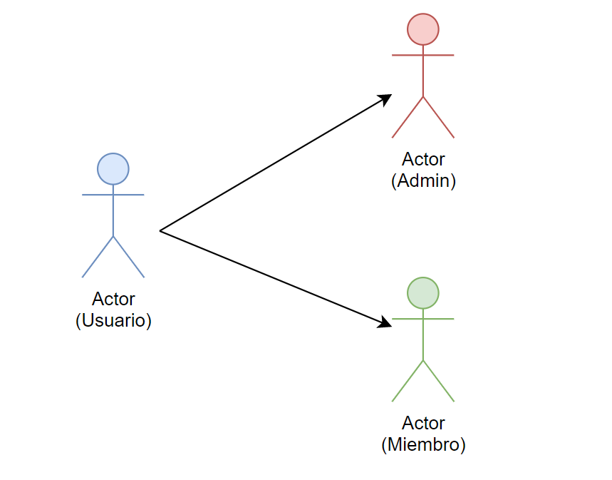
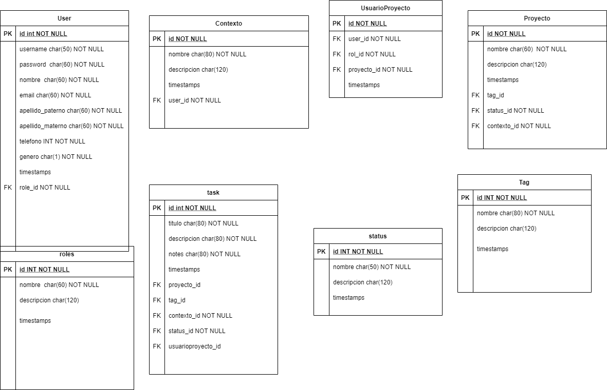

# Desarrollo Web Full Stack JavaScript
## Proyecto de Backend Fundamentals

### *Temática*
API orientada a una la administración de tareas/actividades, como una to-do list. 

### *Alcance*
Tener una aplicación que permita introducir tareas dentro de un proyecto, y que estas a la vez tengan un ambiente determinado 
de trabajo con jererquía de:

proyecto => entorno => tarea

Hay un usuario que es el administrador del proyecto con permisos elevados como crear proyectos, asignar tareas, eliminar 
proyectos y entornos, entre otros, y un usuario (miembro) que puede consultar el listado de tareas e interactuar con las 
tareas que el administrador le asigna.

### *Equipo 4*
* José Ramón Carreño García
* Zaire Tanahi Díaz López
* Alicia Flores Flores
* Iván Gutiérrez Elizalde

# Estructura del Proyecto
## Entidades

<p align="center">
  
</p>

En la aplicación interactuán ususarios de forma general, sin embargo, estos mismos se dividen en dos (miembro 
y administrador de proyecto), ya que ciertas acciones sólo pueden ser llevadas a cabo según el tipo de usuario, 
es decir, tienen permisos establecidos dentro de la aplicación.

## Historias de Usuario

* **Usuario**

| Cómo | Quiero | Para |
| --- | --- | --- |
| usuario | registrarme a la aplicación | crear una cuenta |
| usuario | iniciar sesión | usar la herramienta |
| usuario | editar mi cuenta | actualizar mis datos |
| usuario | eliminar mi cuenta | darme de baja |
| usuario | crear tareas | llevar registro de mis pendientes |
| usuario | editar tareas | modificar su información |
| usuario | eliminar tareas | desechar las que no llevaré a cabo |
| usuario | consultar mis tareas | verificar mi avance |
| usuario | consultar el entorno | tener el contexto del proyecto |
| usuario | consultar el listado de tareas | verificar mi avance |
| usuario | marcar las tareas | cambiar su estatus |
| usuario | consultar un entorno de actividad | visualizar las tareas |
| usuario | consultar los proyectos existentes | conocer el estatus global |


* **Administrador del proyecto**

| Cómo | Quiero | Para |
| --- | --- | --- |
| administrador | crear un entorno de actividad | organizar mis tareas |
| administrador | editar un entorno de actividad| modificar sus propiedades |
| administrador | eliminar un entorno de actividad | evitar entornos innecesarios |
| administrador | crear un proyecto | coordinar mis tareas |
| administrador | asignar tareas | delegar actividades |
| administrador | eliminar un proyecto | removerlo de los pendientes en la aplicación |

  
## Casos de uso
<p align="center">
  
</p>

# Descripción Técnica
## Instrucciones
Para clonar este repositorio se debe abrir la consola y ejecutar los siguientes comandos:

```git
git clone https://github.com/ivanDK5/equipo-4-to-do-api
```

Abrir el folder en el editor de su preferencia y en la terminal ejecutar los siguientes comandos:
_(Nota: debe tener instalado node con npm incluído)_

```npm
npm install
npm run start
```

`npm install` instala todas las dependencias incluidos en package.json 

`npm run start` es el script para ejecutar el servidor

### Herramientas

| Nombre | Descripción |
| --- | --- |
| Body Parser | Extrae toda la parte del cuerpo de una secuencia de solicitud entrante |
| Express | Framework para node |
| Express-jwt | Middleware de autenticación de JWT |
| Cors | Middleware a Connect/Express que puede utilizarse para habilitar el control de acceso CORS |
| Mongoose | Permite escribir consultas para una base de datos de MongooDB |
| Mongoose-unique-validator | Plugin que añade validación para campos únicos de un esquema de Mongoose |
| Passport | Framework para gestionar la autenticación (trabaja en combinación de Connect y Express) |
| Passport-local | Estrategia de passport para autentificar con usuario y contraseña |
| Jsonwebtoken | Implementación de Token Web JSON (simétrico y asimétrico) |
| Crypto | Módulo que entrega un algoritmo que realiza cifrado y descifrado de datos.

Para instalar estas dependencias:

`npm install dependencias dependencias`

```javascript
npm install express body-parser cors crypto passport passport-local express-jwt mongoose mongoose-unique-validator  ...todas las dependencias separadas por espacio
```
### *MongoDB*
Es una base de datos de documentos que ofrece una gran escalabilidad y flexibilidad, y un modelo de consultas e indexación avanzado.

### Diagrama de Base de Datos
Diagrama donde se muestra la estructura de la base de datos y sus objetos, al igual que sus propiedades.

<p align="center">
  
</p>

### Swagger
Aquí dejamos el link de nuestro Swagger: 
https://app.swaggerhub.com/apis/rcarreno90/ToDoAPI/0.0.1


### Api To-Do en Heroku
Accede a nuestra API desde Heroku

https://todo-api-bedu.herokuapp.com/
